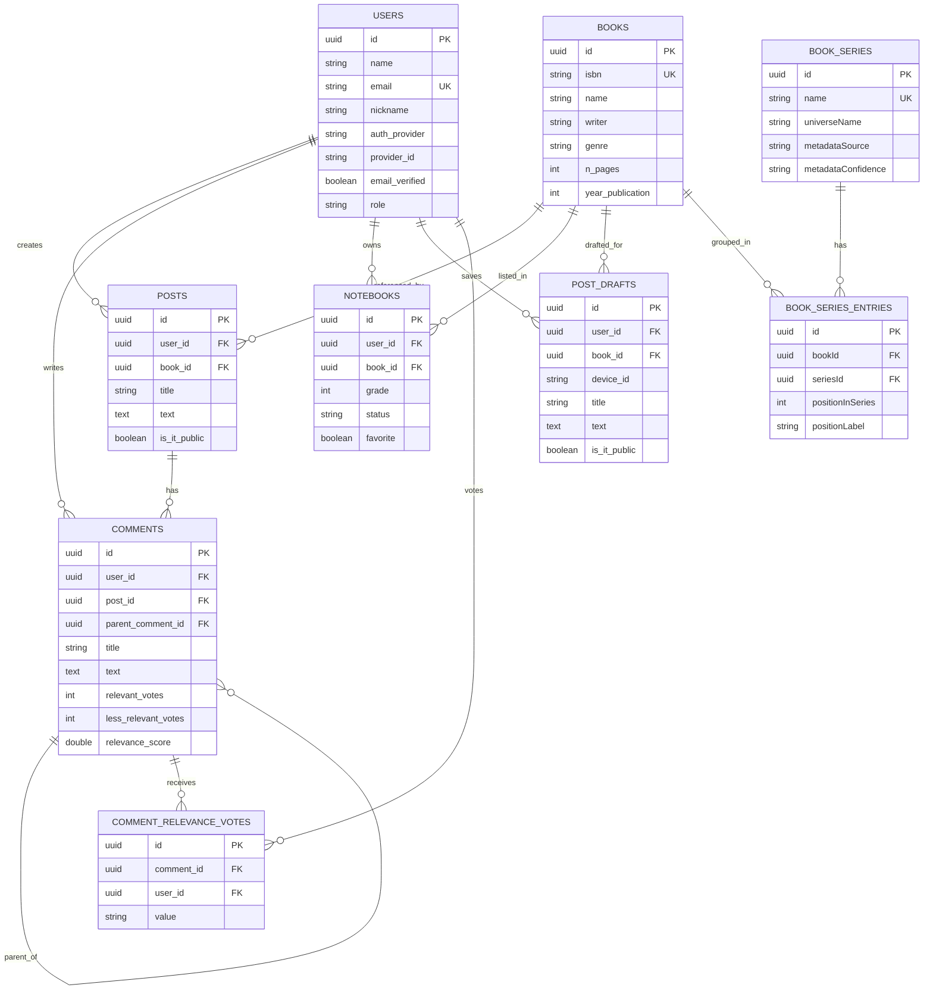
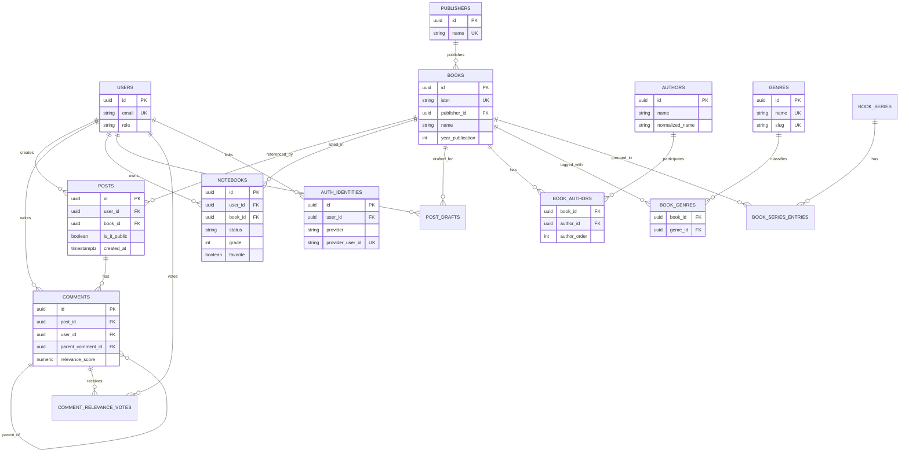

# Remodelacao e Migracao de Banco de Dados - Lampiao

## Objetivo
Este documento consolida a analise de remodelacao do banco do Lampiao para crescimento em complexidade e carga, com foco em PostgreSQL, seguranca de migracoes, performance e consistencia arquitetural (hexagonal).

---

## 1. Diagnostico Atual

### 1.1 Gargalos e riscos principais
1. Configuracao de banco inconsistente entre runtime e migracoes.
- `backend/src/config/database.ts` aponta para MySQL.
- `backend/config/config.js` aponta para PostgreSQL.
- `backend/config/config.json` ainda aponta para MySQL.
- Risco: comportamento imprevisivel entre ambientes, migracoes falhando e acoplamento historico.

2. Padrao N+1 em consultas criticas.
- Listagem de comentarios com verificacao de visibilidade consulta post por post.
- Agregacao de posts por serie consulta livro a livro e processa em memoria.
- Risco: degradacao de p95/p99 com crescimento de dados.

3. Ausencia de paginacao/cursor em endpoints volumosos.
- Listagens sem limite claro retornam conjuntos inteiros.
- Risco: payload grande, pressao de memoria e latencia alta.

4. Integridade parcialmente garantida so no codigo.
- Regras de unicidade de notebook por usuario/livro estao na aplicacao, mas falta reforco total por constraint transacional no banco.
- Risco: condicao de corrida em carga concorrente.

5. Modelagem com sinais de evolucao nao suportados de forma ideal.
- Genero agregado em texto dificulta filtros e analytics.
- Funcionalidades de descoberta social e narrativa de series exigem consultas mais especializadas.

### 1.2 Nivel de risco
- Curto prazo: medio-alto.
- Medio prazo (crescimento de usuarios e conteudo): alto.

---

## 2. Regras de negocio observadas

1. Posts podem ser publicos ou privados (`is_it_public`), com visibilidade por autor.
2. Comentarios suportam arvore (`parent_comment_id`) e voto de relevancia por usuario.
3. Usuario nao pode votar relevancia no proprio comentario.
4. Notebook representa relacao usuario-livro com status de leitura, nota e favorito.
5. Rascunho de post e unico por usuario + livro + device.
6. Livros podem ser associados a series com posicao narrativa.
7. Admin possui operacoes de moderacao e gestao de recursos.

---

## 3. Arquitetura alvo de dados

### 3.1 Decisao principal
PostgreSQL como base transacional unica (source of truth), mantendo separacao hexagonal:
- `core/*`: regras de negocio e contratos.
- `adapters/*`: persistencia e detalhes de infraestrutura.

### 3.2 Modelo alvo (evolutivo)

#### Dominio Identidade
- `users`
- `auth_identities` (opcional futuro para provedores multiplos)
- `refresh_tokens` ou `sessions` (opcional para rastreabilidade e revogacao)

#### Dominio Catalogo
- `books`
- `authors` (novo)
- `book_authors` (novo)
- `publishers` (novo)
- `genres` (novo)
- `book_genres` (novo)
- `book_series`
- `book_series_entries`

#### Dominio Social
- `posts`
- `post_drafts`
- `comments`
- `comment_relevance_votes`

#### Dominio Leitura
- `notebooks`
- `reading_events` (opcional futuro para timeline/historico)

### 3.3 Indices prioritarios
1. `posts(book_id, is_it_public, created_at desc)`
2. `posts(user_id, created_at desc)`
3. `comments(post_id, created_at)`
4. `comments(post_id, parent_comment_id)`
5. `comments(user_id, created_at)`
6. `comment_relevance_votes(comment_id, user_id)` unique
7. `notebooks(user_id, book_id)` unique
8. `book_series_entries(series_id, position_in_series)`
9. `book_series_entries(book_id, series_id)` unique

### 3.4 SQL e NoSQL
- Curto prazo: PostgreSQL + cache Redis (opcional).
- Medio prazo: mecanismo de busca dedicado (OpenSearch/Meilisearch) para full-text e relevancia social.
- Sem migracao prematura para NoSQL transacional.

---

## 4. Plano de migracao (incremental e reversivel)

### Fase A - Estabilizacao de plataforma
1. Unificar configuracoes em PostgreSQL para runtime e CLI.
2. Padronizar variaveis: `DB_DIALECT`, `DB_PASSWORD`, `DB_PORT=5432`.
3. Remover ambiguidade de MySQL do fluxo principal.

Compatibilidade: total.
Downtime: nenhum.
Rollback: restaurar configs anteriores.

### Fase B - Integridade e performance aditiva
1. Criar constraints e indices faltantes (sem remover legado).
2. Garantir unicidade transacional de notebook por usuario/livro.
3. Adicionar indices para consultas de post/comentario/serie.

Compatibilidade: alta.
Downtime: minimo (usar operacoes online quando possivel).
Rollback: drop de indices/constraints novos.

### Fase C - Remodelacao do catalogo
1. Introduzir tabelas normalizadas (`authors`, `genres`, etc).
2. Backfill idempotente a partir de `books`.
3. Dual-write temporario no adapter.

Compatibilidade: media-alta (feature flag).
Downtime: nenhum esperado.
Rollback: desativar dual-write e manter leitura no modelo antigo.

### Fase D - Otimizacao de query paths
1. Eliminar N+1 em comentarios e series.
2. Introduzir paginacao por cursor nos endpoints de lista.
3. Criar projections/read-models quando necessario.

Compatibilidade: alta com versionamento de API.
Downtime: nenhum.
Rollback: retorno por feature flag.

### Fase E - Cleanup
1. Remover colunas/tabelas legadas apos validacao de estabilidade.
2. Consolidar documentacao operacional e runbooks.

Compatibilidade: planejada.
Downtime: curto, se houver DDL pesada.
Rollback: snapshot + scripts reversos.

---

## 5. Mudancas recomendadas de ferramentas

### 5.1 Persistencia no backend
Opcoes validas sem quebrar hexagonal:
1. Manter Sequelize no curto prazo para reduzir risco.
2. Migrar para Prisma no medio prazo (schema forte e ergonomia de migracao).
3. Alternativa: Drizzle/Kysely para SQL mais explicito em hot paths.

Recomendacao pragmatica:
- Agora: estabilizar com Sequelize + SQL dirigido por indice.
- Depois: avaliar Prisma para reduzir complexidade de manutencao.

### 5.2 Operacao de banco
1. `pg_stat_statements` habilitado.
2. Rotina de backup full + PITR.
3. Pooling com PgBouncer em ambiente de alta concorrencia.
4. Dashboards (latencia, lock, deadlock, bloat, hit ratio).

---

## 6. Evidencias de validacao esperadas

### 6.1 Baseline (antes)
1. P95/P99 de endpoints de listagem.
2. Contagem de queries por request (detectar N+1).
3. EXPLAIN ANALYZE dos endpoints criticos.

### 6.2 Metas (depois)
1. Reducao de 40-70% em latencia das listagens criticas.
2. Queda relevante de queries por request em comentarios/series.
3. Payload menor com paginacao por cursor.
4. Zero duplicata de notebook sob concorrencia.

### 6.3 Checklist de verificacao
1. Migracoes forward e rollback executam sem erro.
2. Constraints e indices aparecem no catalogo do banco.
3. EXPLAIN mostra uso de index scan nos fluxos criticos.
4. Testes de carga validam p95 dentro da meta.

---

## 7. Plano operacional (local e nuvem)

### 7.1 Local
1. Docker Compose com PostgreSQL unico.
2. Seeds de desenvolvimento controladas.
3. Script de reset seguro para ambiente local.

### 7.2 Nuvem
1. PostgreSQL gerenciado (RDS/Cloud SQL/Supabase).
2. Backups automaticos + teste de restore mensal.
3. Segredos via secret manager.
4. Replica de leitura conforme crescimento.

### 7.3 Seguranca
1. TLS em transito.
2. Credenciais rotacionadas.
3. Principio de menor privilegio (`app_rw`, `app_ro`, `migration_admin`).

---

## 8. Diagrama visual - relacoes entre tabelas

## 8.1 Modelo atual (consolidado)

## 8.2 Modelo alvo (evolutivo)

---

## 9. Proximos passos recomendados

1. Fase A imediata: unificar configuracao para PostgreSQL em runtime + CLI.
2. Fase B em seguida: constraints e indices de performance.
3. Abrir roadmap tecnico para Fase C/D com feature flags e benchmark.
4. Definir oficialmente a stack de persistencia para os proximos 12 meses.

---

## 10. Decisoes pendentes para aprovacao

1. Ferramenta de persistencia no medio prazo: manter Sequelize ou migrar para Prisma/Drizzle.
2. Janela de compatibilidade para dual-write na remodelacao de catalogo.
3. Estrategia de busca futura: manter SQL puro ou introduzir mecanismo dedicado.

Se aprovado, o proximo entregavel pode ser um pacote tecnico com:
- migrations SQL (Fase A e B),
- ajustes de repositores para eliminar N+1,
- paginacao por cursor,
- e checklist de validacao automatizada.
