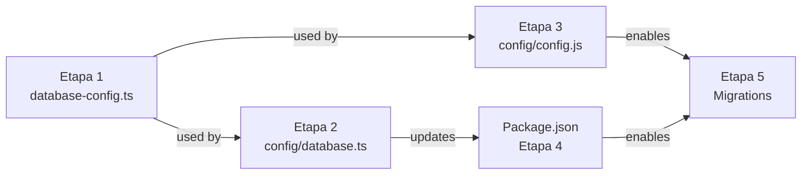

# 📊 Análise Detalhada: Migração MySQL → PostgreSQL

## 1. Estado Atual da Arquitetura

### 1.1 Stack de Dependências
```
├── Core (Sem dependência de DB)
│   ├── domain/          (Entidades puras)
│   ├── ports/           (Interfaces de repositório)
│   ├── usecases/        (Lógica de negócio)
│   └── errors/          (Exceções de domínio)
│
├── Adapters (Implementação concreta)
│   ├── repositories/    (SequelizeXxxRepository)
│   ├── models/          (Sequelize Models)
│   └── services/        (GoogleAuth, etc)
│
└── Camada de Persistência
    ├── config/database.ts  → Dialect: mysql
    ├── config/config.js    → Dialect: mysql
    └── migrations/         → SQL agnóstico (mas validar)
```

### 1.2 Problemas Atuais

| Problema | Impacto | Severidade |
|----------|--------|-----------|
| `config/database.ts` hardcoded para MySQL | Código acoplado ao dialect | 🔴 Alta |
| `config/config.json` hardcoded para MySQL | Sequelize CLI usa dialect fixo | 🔴 Alta |
| Dependências: `mysql2` + `sequelize` | Binários nativos compiláveis | 🟡 Média |
| Migrations podem usar SQL MySQL específico | Incompatibilidade com PostgreSQL | 🟠 Média |
| Não há abstração de dialect | Falta porta para DB connection | 🔴 Alta |
| Variáveis de environment inconsistentes | `DB_PASS` vs `DB_PASSWORD` | 🟡 Média |

### 1.3 Pontos Fortes da Arquitetura

✅ **Core isolado** — Não tem dependência de ORM  
✅ **Repositories implementam interfaces** — Fácil trocar implementação  
✅ **Models Sequelize** estão em adapters (limite correto)  
✅ **DTOs** mapeiam entre domain e models  
✅ **Injeção de dependência** via container

---

## 2. Plano de Migração: 5 Etapas

### Etapa 1️⃣: Criação de Abstração de Dialect

**Objetivo**: Remover hardcoding de dialect, permitir múltiplos bancos

#### 2.1.1 Criar `backend/src/config/database-config.ts`

```typescript
// Centralizar configuração, agnóstica de dialect
import 'dotenv/config';

export type SupportedDialect = 'mysql' | 'postgres';

export interface DatabaseConfig {
  dialect: SupportedDialect;
  username: string;
  password: string;
  database: string;
  host: string;
  port: number;
  logging: boolean | ((sql: string) => void);
}

/**
 * Factory para Database Config
 * Resolve de env, com fallbacks sensatos
 */
export function getDatabaseConfig(): DatabaseConfig {
  const dialect = (process.env.DB_DIALECT || 'postgres') as SupportedDialect;
  
  return {
    dialect,
    username: process.env.DB_USER || 'lampiao',
    password: process.env.DB_PASSWORD || 'lampiao_dev_password',
    database: process.env.DB_NAME || 'lampiao_db',
    host: process.env.DB_HOST || 'localhost',
    port: Number(process.env.DB_PORT) || (dialect === 'postgres' ? 5432 : 3306),
    logging: process.env.DB_LOG === 'true' ? console.log : false,
  };
}
```

**Arquivos a criar**:
- `backend/src/config/database-config.ts`

**Dependência**: Nenhuma

---

### Etapa 2️⃣: Atualizar `config/database.ts`

**Objetivo**: Usar novo factory ao invés de hardcoding MySQL

```typescript
// ANTES
const sequelize = new Sequelize(
  process.env.DB_NAME  || 'lampiao_api',
  process.env.DB_USER  || 'root',
  process.env.DB_PASS  || 'root',
  {
    host:    process.env.DB_HOST || '127.0.0.1',
    port:    Number(process.env.DB_PORT) || 3306,
    dialect: 'mysql',  // ← HARDCODED
    logging: false,
  }
);

// DEPOIS
import { getDatabaseConfig } from '../src/config/database-config';

const config = getDatabaseConfig();
const sequelize = new Sequelize(
  config.database,
  config.username,
  config.password,
  {
    host: config.host,
    port: config.port,
    dialect: config.dialect,  // ← DINÂMICO
    logging: config.logging,
  }
);
```

**Arquivos a modificar**:
- `backend/config/database.ts`

**Dependência**: Etapa 1

---

### Etapa 3️⃣: Atualizar `config/config.js`

**Objetivo**: Usar novo factory e suportar múltiplos dialects

```javascript
// ANTES
module.exports = {
  development: {
    username: process.env.DB_USER || 'root',
    password: process.env.DB_PASS || '',
    database: process.env.DB_NAME || 'lampiao_api',
    host: process.env.DB_HOST || '127.0.0.1',
    port: Number(process.env.DB_PORT) || 3306,
    dialect: 'mysql',  // ← HARDCODED
  },
  // ... test, production
};

// DEPOIS
// Não precisa require de arquivo TypeScript,
// Pode usar env vars direto
const getConfig = (env) => ({
  username: process.env.DB_USER || 'lampiao',
  password: process.env.DB_PASSWORD || 'lampiao_dev_password',
  database: process.env.DB_NAME || 'lampiao_db',
  host: process.env.DB_HOST || 'localhost',
  port: Number(process.env.DB_PORT) || 5432,
  dialect: process.env.DB_DIALECT || 'postgres',  // ← DINÂMICO
  logging: false,
});

module.exports = {
  development: getConfig('development'),
  test: {
    ...getConfig('test'),
    database: process.env.DB_TEST_NAME || 'lampiao_test_db',
  },
  production: {
    use_env_variable: 'DATABASE_URL',
    dialect: process.env.DB_DIALECT || 'postgres',
  },
};
```

**Arquivos a modificar**:
- `backend/config/config.js` (converter para CommonJS dinâmico)

**Dependência**: Etapa 1 (indireto)

---

### Etapa 4️⃣: Atualizar Dependências do `package.json`

**Objetivo**: Remover MySQL, manter apenas PostgreSQL

#### Ação 1: Remover mysql2
```json
// ANTES
"dependencies": {
  "mysql2": "^3.9.7",  // ← REMOVER
  "sequelize": "^6.37.3",
}

// DEPOIS
"dependencies": {
  "pg": "^8.11.3",        // ← MANTER (já está)
  "sequelize": "^6.37.3",  // ← MANTER
}
```

#### Ação 2: Verificar devDependencies
```json
"devDependencies": {
  "sequelize-cli": "^6.6.2",  // ← VERIF. se precisa mysql2
}
```

**Nota**: `sequelize-cli` não requer mysql2 se dialect no config.js for 'postgres'

**Arquivos a modificar**:
- `backend/package.json`

**Dependência**: Etapa 3

---

### Etapa 5️⃣: Validar Migrations para PostgreSQL

**Objetivo**: Garantir que todas as migrations rodem em PostgreSQL

#### Checklist de Compatibilidade

Para cada migration em `backend/migrations/`:

| Aspecto | MySQL | PostgreSQL | Ação |
|--------|-------|-----------|------|
| Auto-increment | `SERIAL` / `autoIncrement: true` | `SERIAL` (nativo) | ✅ Compatível |
| UUID | `CHAR(36)` | `UUID` type | ✅ Compatível (Sequelize abstrai) |
| VARCHAR | `VARCHAR(255)` | `VARCHAR(255)` | ✅ Compatível |
| Timestamps | `TIMESTAMP DEFAULT CURRENT_TIMESTAMP` | `TIMESTAMP DEFAULT CURRENT_TIMESTAMP` | ✅ Compatível |
| Foreign Keys | `CONSTRAINT` syntax | `CONSTRAINT` syntax | ✅ Compatível |
| Indices | `INDEX` / `UNIQUE` | `INDEX` / `UNIQUE` | ✅ Compatível |
| Case sensitivity | Insensitivo por padrão | Sensível | ⚠️ Verificar |
| Booleans | `TINYINT(1)` | `BOOLEAN` | ✅ Sequelize abstrai |
| JSON | JSON type | JSON type | ✅ Compatível |

#### Script de Validação

```bash
# Rodar migrations em test database PostgreSQL
NODE_ENV=test \
DB_DIALECT=postgres \
DB_HOST=localhost \
DB_PORT=5432 \
DB_USER=lampiao \
DB_PASSWORD=lampiao_pwd \
DB_NAME=lampiao_test_db \
  npx sequelize-cli db:migrate
```

**Arquivos a verificar**:
- `backend/migrations/*.js` (todos)

**Dependência**: Etapa 3 (config.js dinâmico)

---

## 3. Verificação de Type Safety

Adicionar tipos ao Sequelize para garantir segurança:

```typescript
// backend/src/adapters/models/BookModel.ts
import { Model, DataTypes } from 'sequelize';
import sequelize from '../../config/database';

interface BookAttributes {
  id: string;
  name: string;
  isbn: string;
  publishing_company: string;
  writer: string;
  genre: string;
  n_pages: number;
  year_publication: number;
  img: string | null;
  synopsis: string | null;
  createdAt?: Date;
  updatedAt?: Date;
}

export class Book extends Model<BookAttributes, Omit<BookAttributes, 'id'>> 
  implements BookAttributes {
  // ... atributos tipados
}

Book.init({
  // ... tipos garantem que não há incompatibilidade
}, {
  sequelize,
  tableName: 'books',
  timestamps: true,
});
```

---

## 4. Variáveis de Environment

### Consistência de Nomes

**ANTES** (inconsistente):
```env
DB_USER=root
DB_PASS=root        # ← Inconsistente
DB_NAME=lampiao_api
DB_HOST=127.0.0.1
DB_PORT=3306        # ← Hardcoded para MySQL
```

**DEPOIS** (consistente):
```env
DB_DIALECT=postgres         # ← Novo
DB_USER=lampiao
DB_PASSWORD=lampiao_pwd     # ← Consistente
DB_NAME=lampiao_db
DB_HOST=localhost
DB_PORT=5432                # ← Dinâmico baseado em dialect
DB_LOG=false
```

### Backward Compatibility

Para não quebrar deployments existentes, adicionar fallbacks:

```typescript
const dialect = process.env.DB_DIALECT || 'postgres';
const password = process.env.DB_PASSWORD || process.env.DB_PASS || 'default';
const port = Number(process.env.DB_PORT) || (dialect === 'postgres' ? 5432 : 3306);
```

---

## 5. Matriz de Execução

| Etapa | Arquivo(s) | Tipo | Teste | Risco |
|-------|-----------|------|-------|-------|
| 1 | `src/config/database-config.ts` | **Criar** | Unit test | 🟢 Baixo |
| 2 | `config/database.ts` | **Modificar** | Integration | 🟡 Médio |
| 3 | `config/config.js` | **Modificar** | CLI test | 🟡 Médio |
| 4 | `package.json` | **Modificar** | npm install | 🔴 Alto |
| 5 | `migrations/*.js` | **Verificar** | db:migrate | 🟡 Médio |

---

## 6. Dependências de Execução



**Ordem Recomendada**:
1. ✅ Etapa 1 (criar novo arquivo)
2. ✅ Etapa 2 (refatorar database.ts)
3. ✅ Etapa 3 (refatorar config.js)
4. ✅ Etapa 4 (atualizar package.json)
5. ✅ Etapa 5 (testar migrations)

---

## 7. Teste de Validação Pós-Migração

### 7.1 Testes Unitários

```typescript
// backend/src/__tests__/config/database-config.test.ts
describe('getDatabaseConfig', () => {
  it('should return postgres config by default', () => {
    const config = getDatabaseConfig();
    expect(config.dialect).toBe('postgres');
    expect(config.port).toBe(5432);
  });

  it('should return mysql config when DB_DIALECT=mysql', () => {
    process.env.DB_DIALECT = 'mysql';
    const config = getDatabaseConfig();
    expect(config.dialect).toBe('mysql');
    expect(config.port).toBe(3306);
  });
});
```

### 7.2 Testes de Integração

```bash
# Testar cada repositório com PostgreSQL
npm test -- SequelizeBookRepository
npm test -- SequelizeUserRepository
# ... etc
```

### 7.3 Testes de Migrations

```bash
# Criar database limpo e rodar migrations
docker run --name test-postgres -e POSTGRES_PASSWORD=test -d postgres:15
docker exec test-postgres psql -U postgres -c "CREATE DATABASE lampiao_test_db;"

NODE_ENV=test DB_DIALECT=postgres npx sequelize-cli db:migrate
npx sequelize-cli db:migrate:undo:all  # Verificar reversão

# Cleanup
docker stop test-postgres
docker rm test-postgres
```

---

## 8. Rollback Strategy

Se algo der errado:

1. **Revert database.ts** → aponta de volta para MySQL
2. **Revert config.js** → dialect: 'mysql'
3. **Reinstalar mysql2** → `npm install mysql2`
4. **Usar env var** → `DB_DIALECT=mysql`

---

## 9. Documentação Necessária

Criar/atualizar:

- [ ] `.env.example` — com DB_DIALECT=postgres
- [ ] `DOCKER_SETUP.md` — PostgreSQL por padrão
- [ ] `README.md` — como mudar de dialect (advanced)
- [ ] `backend/CONFIG.md` — explicar database-config.ts

---

## 10. Timeline Estimado

| Atividade | Tempo | Dependências |
|-----------|-------|--------------|
| Etapa 1: Criar database-config.ts | 30 min | — |
| Etapa 2: Refatorar database.ts | 20 min | Etapa 1 |
| Etapa 3: Refatorar config.js | 20 min | Etapa 1 |
| Etapa 4: Atualizar package.json | 10 min | Etapa 3 |
| Etapa 5: Testar migrations | 1-2 h | Etapa 4 |
| Testes e validação | 1-2 h | Etapa 5 |
| **Total** | **4-5 horas** | — |

---

## 11. Próximos Passos

1. **Aprovar análise** ✋
2. **Executar Etapa 1** (database-config.ts)
3. **Executar Etapa 2-5** sequencialmente
4. **Testar em Docker** ✅
5. **Commit com mensagem clara** 📝

---

**Status**: 🔍 Análise Completa  
**Recomendação**: ✅ Proceder com implementação

